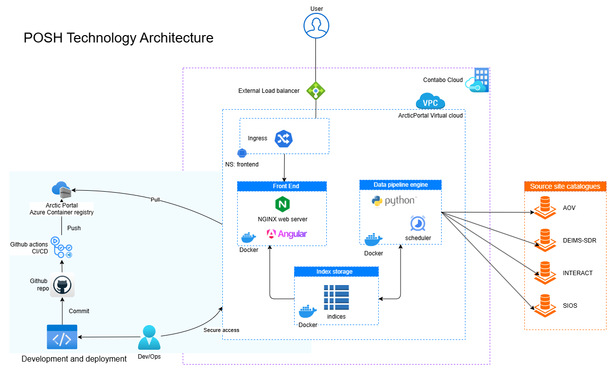

<div align="center">


# POSH — Polar Observing Site Hub

[](https://github.com/arcticportal/posdt/actions/workflows/ci.yml)


A unified discovery hub for polar observing sites — research stations, observatories, and monitoring networks across the Arctic and Antarctic.

[Overview](#overview) · [Architecture](#architecture) · [Data sources](#data-sources) · [Features](#features) · [Data model](#data-model) · [Tech stack](#tech-stack) · [Getting started](#getting-started) · [Project structure](#project-structure) · [Configuration](#configuration)

</div>

## Overview

**POSH (Polar Observing Site Hub)** brings together metadata from multiple polar sites catalogs and exposes them through a single map-driven, searchable interface. It is designed for researchers, network coordinators, and the public who need to answer questions like: *who is observing where, what variables are being measured, and which network does a given station belong to?*

The platform is built as two cooperating services sharing a single data source:

- A scheduled **data engine** (Python) that fetches raw metadata from external site catalogs, normalizes them into a common schema, and stores it locally for the frontend to consume. it helps to provid a faster response and also avoid hitting the external catalogs too often.
- An **Angular SPA** (served by NGINX) renders an interactive map and a list view, and supports search and faceted filtering.

A failure in any pipeline stage is non-destructive: the previous successful dataset keeps being served until a new one is fully written.

## Architecture



## Data sources

The data engine periodically fetches metadata from public catalogs and parses it into a unified schema. Each source has its own parser which maps data to a common schema. These fetched and standardized records are thus further processed into efficient sotrage to enable fatser load times for the frontend. Records outside polar latitudes (|lat| < 50°) are filtered out at parse time.

|For list of sources, see [POSH website](https://polarobservingsites.org/about).

## Features

- **Multi-source aggregation** — single hub over catalogs that are otherwise scattered and use incompatible schemas.
- **Scheduled, failure-safe pipeline** — `download → sequence → prune` runs on a configurable schedule . A failure in any stage leaves the previously published  dataset intact.
- **Polar-only filter** — sites outside polar latitudes are dropped at parse time.
- **Map view** — MapLibre GL globe with site points, color-coded by source catalog and network.
- **List view** — paginated table of the same dataset with deep-linkable URLs.
- **Faceted filtering** — by source catalog, country, and network.
- **Free-text search** — case-insensitive regex match across every field of every record.
- **Shareable URLs** — filter / search / mode / page state lives entirely in query parameters, so any view is linkable.
- **Containerised end to end** — Angular SPA, backend data pipeline, schedule and storage are all defined in containerized setup.

## Data model

Every record is written to a common flat schema. Parsers populate what is known and leave the rest absent — no required fields except those used for identification and grouping.

`POSDT ID` is the primary key used by the frontend for stable deep links (`/sites/:posdt_id`).

For more details on the schema, see [the data model documentation](https://polarobservingsites.org/faq).

## Tech stack

| | |
| --- | --- |
| **Backend** | Python 3.13 · `urllib` · custom parsers · [supercronic](https://github.com/aptible/supercronic) (cron for containers) |
| **Frontend** | Angular 19 · TypeScript · MapLibre GL · RxJS · Angular signals |
| **Serving** | NGINX (frontend) |
| **Infra** | Docker Compose · GitHub Actions (CI Gate) · Azure Container Registry |

## Getting started

> [!NOTE]
> The two services share a single data store. Always start the backend before the frontend on a fresh volume, or wait for the first scheduled pipeline run to populate it. The frontend will render an empty dataset gracefully in the meantime.

### Prerequisites

- [Docker](https://docs.docker.com/get-docker/) and Docker Compose
- (Optional, for frontend-only development) [Node.js 20+](https://nodejs.org/) and npm

### Run the full stack

```bash
# Copy the example env file and edit at least POSH_CRON
cp deploy/.env_example .env

# Start both services (uses dev images by default)
docker compose -f deploy/docker-compose.dev.yml up
```

Once running:

| Service | URL |
|---------|-----|
| Frontend | <http://localhost:8080> |
| Backend container | scheduled as per configuration; no public endpoint |

To trigger an immediate run without waiting for the schedule:

```bash
docker compose -f deploy/docker-compose.dev.yml exec backend python3 /posh/app/run_pipeline.py
```

### Frontend development

For iterative work against a backend that is already populating the data store:

```bash
cd angular
npm install
npm start
```

### Backend development

```bash
cd backend
python3 -m venv .venv && source .venv/bin/activate
pip install -e .
PYTHONPATH=src/posh python3 src/posh/run_pipeline.py
```

> [!TIP]
> The pipeline writes to a hard-coded `/posh/data` directory inside the container. For local backend runs, point `DATA_DIRECTORY` at a writable path (or run inside the container) — see `backend/src/posh/settings.py`.

## Project structure

```
posh/
├── angular/                     # Angular 19 SPA
│   ├── src/app/
│   │   ├── home/                # Landing page (map + filters + results)
│   │   ├── home-globe/          # MapLibre map view
│   │   ├── home-filter/         # Catalog / country / network filters + search
│   │   ├── home-result/         # List view / result table
│   │   ├── sites/               # Detail page per POSDT ID
│   │   ├── about/ contact/ faq/ footer/ header/
│   │   ├── api.service.ts       # Streams JSON-seq files, builds indexes
│   │   ├── model.service.ts     # Filter + search + paginate state
│   │   └── vector.service.ts    # WKT → GeoJSON, bounding boxes
│   └── public/                  # Static JSON-seq.gz + logos served in production
├── backend/
│   ├── pyproject.toml
│   └── src/posh/
│       ├── download.py          # Fetch raw JSON from each source
│       ├── sequence.py          # Parse & normalize → JSON-seq.gz
│       ├── run_pipeline.py      # Chained weekly pipeline
│       ├── settings.py          # DATA_DIRECTORY, RETENTION
│       └── utils.py             # latest_link, prune
├── deploy/
│   ├── backend/                 # Backend Dockerfile + entrypoint.sh
│   ├── frontend/                # Frontend Dockerfile + nginx.conf
│   ├── docker-compose.dev.yml
│   ├── docker-compose.prd.yml
│   ├── deployConfig-dev.yml / prd.yml
│   └── .env_example
└── .github/workflows/           # CI Gate + reusable build workflows
```

## Configuration

All runtime configuration is environment-driven, loaded by Docker Compose from `.env`.

| Variable | Required | Default | Purpose |
| ---------- | ---------- | --------- | --------- |
| `POSH_CRON` | yes | — | Schedule for `download → sequence → prune`. Standard 5-field cron, 7-field (with seconds), `@weekly`/`@daily`/`@hourly`, or `@every <duration>`. Times in `TZ`. |
| `POSH_RETENTION` | no | `3` | Number of dated `download/` and `sequence/` folders to keep (the `latest` symlink counts as one). |
| `TZ` | no | `UTC` | Timezone the cron schedule runs in. |
| `ANGULAR_ENV` | no | `dev` | Angular build configuration baked at image build time (`development` or `production`). |

> [!IMPORTANT]
> `POSH_CRON` is validated at container startup. An invalid expression fails fast with a clear error message and never starts supercronic — no silent no-op scheduling.

> [!TIP]
> For per-environment host configuration (Contabo Cloud, etc.) see the matching `deployConfig-dev.yml` / `deployConfig-prd.yml` alongside the compose files.

## CI

A single [`CI Gate`](./.github/workflows/ci.yml) workflow protects `main` and `dev`. It uses `dorny/paths-filter` to detect which area changed and runs only the matching reusable build:

- `angular/**` or `deploy/frontend/**` → builds the Angular image
- `backend/**` or `deploy/backend/**` → builds the backend image

A final `gate` job aggregates the results into the single required check. On merges to `main`/`dev`, the built image is pushed to `arcticportal.azurecr.io`.

<div align="center">

Built and maintained by the [Arctic Portal](https://arcticportal.org) team.

</div>
